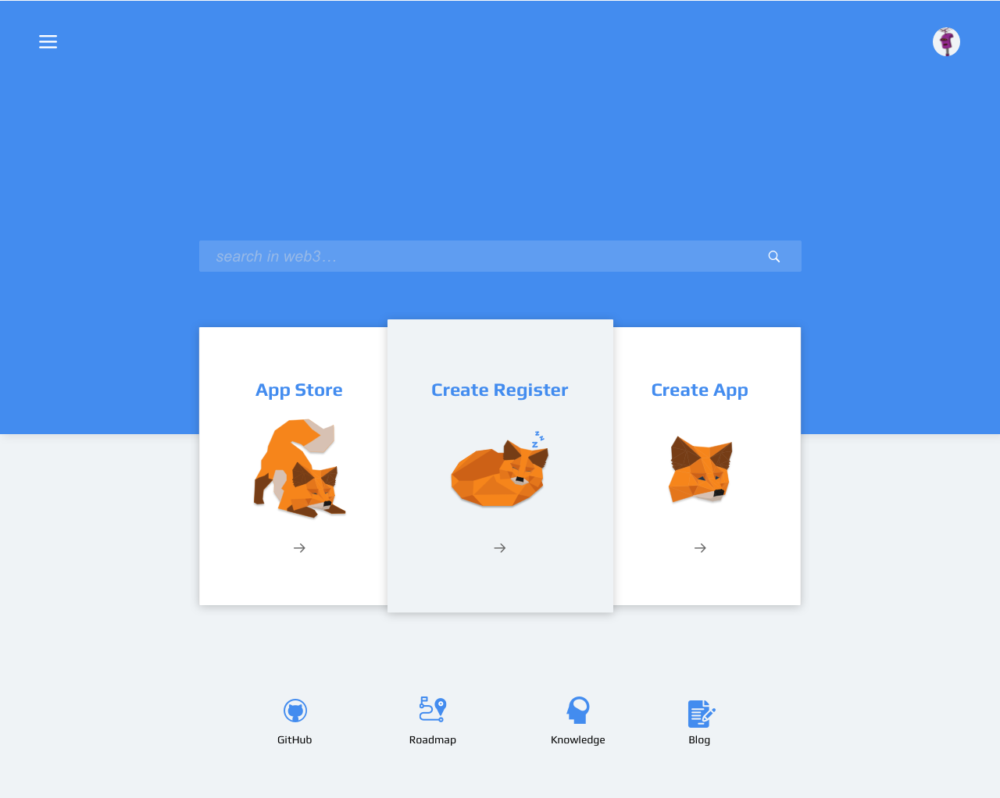
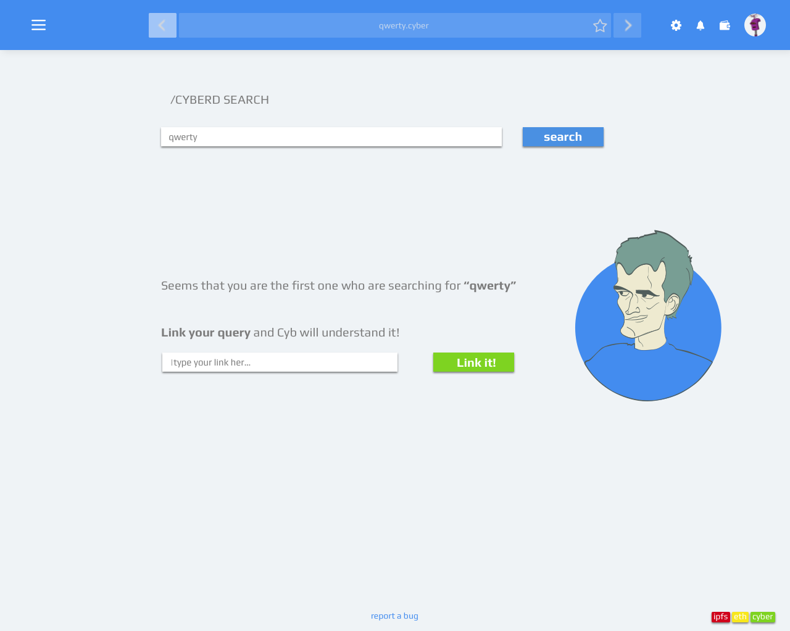
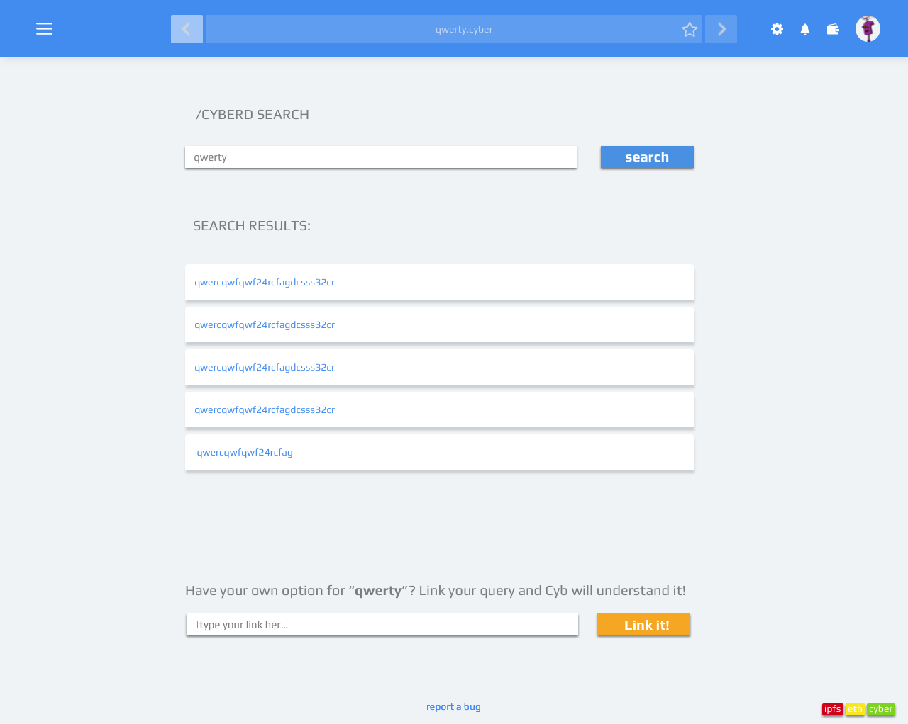

# Artboards

This is an autogenerated file showing all the artboards. Do not edit it directly.

## Background_menu

## Filter

## Main_page

## Main_page_app_bar

## Mempool

## No_results

## No_results_app

## Overrides

## Results

## Search_bar

## Search_bar_close_side_bar

## Search_bar_open_side_bar

## Settings

## Shell_closed_menu

## Shell_opened_menu

## Sidebar

## Wallet

## arrow

## btn

## btn

## ic

## il

## il_robohash

## links

## logo

## logo_2

## menu

## metamask

## search

## side_bar

## star

